# ComfyUI DeepGPU加速社区版 部署文档

## 概述
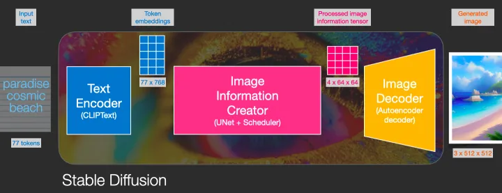

stable diffusion可以通过使用文字生成图片，在整个pipeline中，包含CLIP或其他模型从文字中提取隐变量；通过使用UNET或其他生成器模型进行图片生成。通过逐步扩散(Diffusion)，逐步处理图像，使得图像的生成质量更高。**通过本文，客户可以搭建一个stable diffusion的ComfyUI框架，并使用DeepGPU加速图片生成速度。在512x512分辨率下，AIACC加速能将推理性能从1.91s降低至0.88s，性能提升至2.17倍，同时AIACC支持任意多LORA权重加载，且不影响性能。**

DeepGPU支持优化基于Torch框架搭建的模型，通过对模型的计算图进行切割，执行层间融合，以及高性能OP实现，大幅度提升PyTorch的推理性能。您无需指定精度和输入尺寸，即可通过JIT编译的方式对PyTorch框架下的深度学习模型进行推理优化。具体详见[手动安装AIACC-Inference（AIACC推理加速）Torch版](https://help.aliyun.com/document_detail/317822.html)。

ComfyUI版本基于[https://github.com/comfyanonymous/ComfyUI](https://github.com/comfyanonymous/ComfyUI)仓库，官方文档为[https://blenderneko.github.io/ComfyUI-docs/](https://blenderneko.github.io/ComfyUI-docs/)，如有需要请参阅官方文档。

## 部署流程

### 创建实例
访问计算巢实例([https://computenest.console.aliyun.com/user/cn-hangzhou/recommendService](https://computenest.console.aliyun.com/user/cn-hangzhou/recommendService))，点击创建
**ComfyUI DeepGPU加速社区版。**

选择所需地域:


勾选实例类型，并填写实例密码：


填写登录用户名和密码，用户名和密码在后续登录ComfyUI时使用:


点击下一步:确认订单，并勾选服务条款，点击创建：


稍等片刻，等待部署完成。

## 执行图片生成测试
### 登录页面
点击计算巢控制台中的实例:

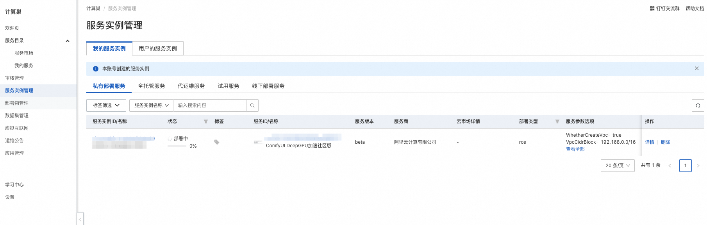

点击其中的endpoint网址：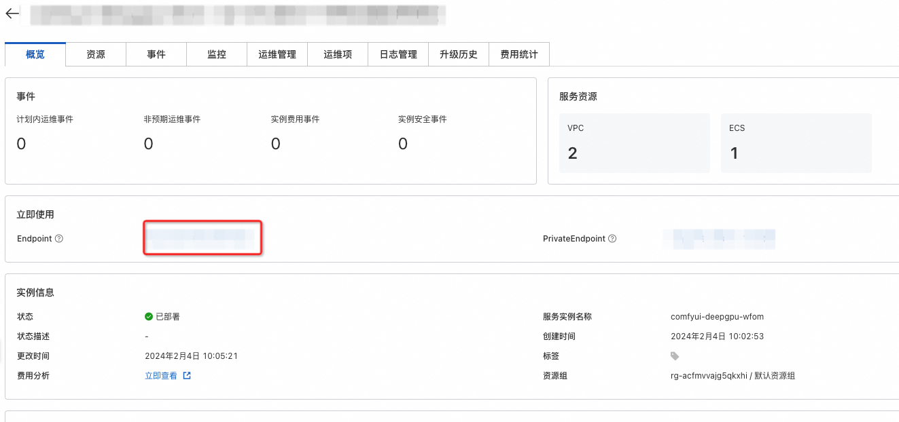

### 测试
输入登录信息中的用户名和密码登录:


进入测试页面:

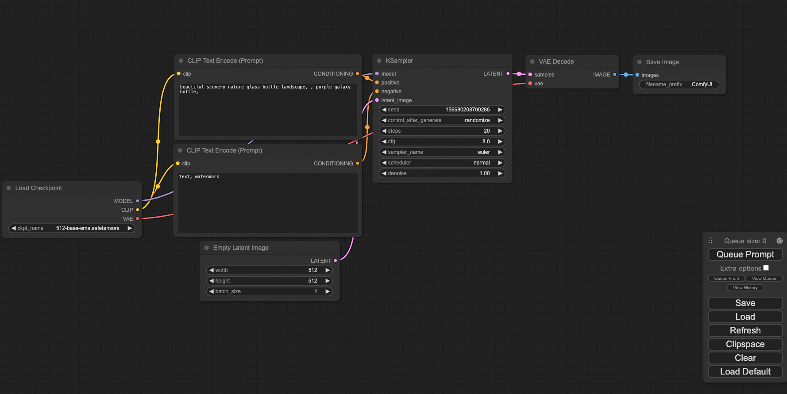

点击**Queue Prompt**，可以生成一张图片:

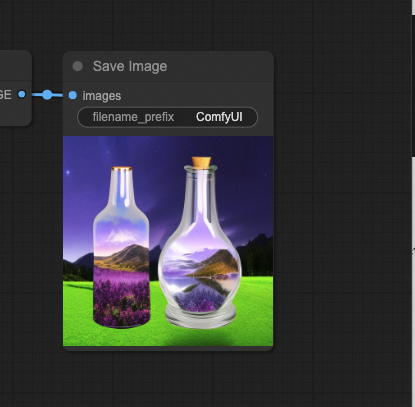

### 模型切换

在测试镜像中，我们预装的模型位于/root/ComfyUI/models/文件夹中，如果需要使用其他模型，可以放置到指定位置，并进行在web页面中进行切换。
例如我们需要切换为预装的stable-diffusion v1.5基准模型，可以将**Load Checkpoint**节点的模型切换为v1-5的模型：

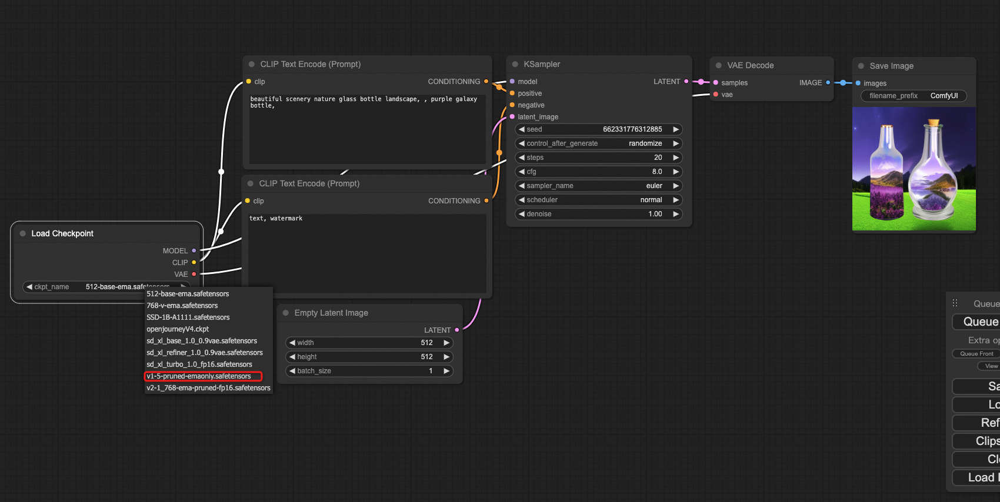

点击**Queue Prompt**生成图片：

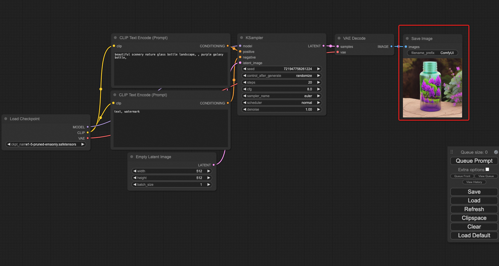

### 性能查看
注意此处我们没有使用DeepGPU进行性能加速，性能为comfyUI+xformers的基准性能。
点击计算巢控制台的资源选项卡，点击远程连接登录服务器：
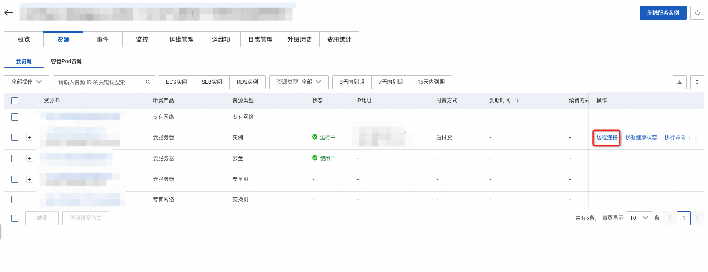
使用如下命令查看日志：
```bash
cat /var/log/comfyui.log
```
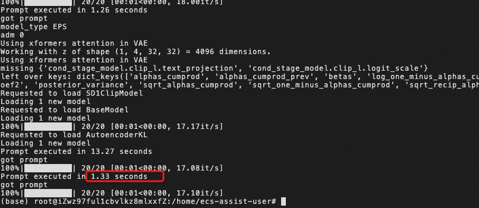

可见未优化情况下单次推理耗时为1.33s。

### 使用DeepGPU加速
注意：DeepGPU加速功能暂为测试版，如遇到任何问题，请删除相关节点并使用默认的自带节点。并使用运维管理的重启comfyUI服务重启服务：

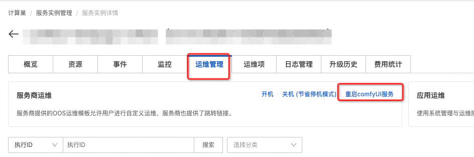

当使用DeepGPU加速时，我们需要使用3个自定义的节点：

- Load AIACC Checkpoint
- Load AIACC LoRA
- load AIACC ComtrolNet

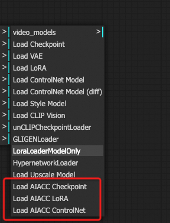

替换原有节点使用。例如在上例中，如果使用DeepGPU加速，则生成流程变更为：

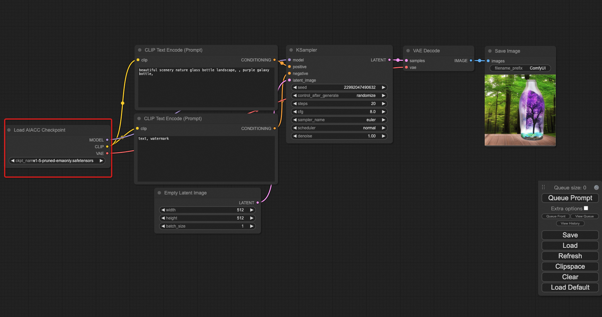

### 加速性能对比
加速后执行时间从1.33s提升至0.8s，如下图所示。

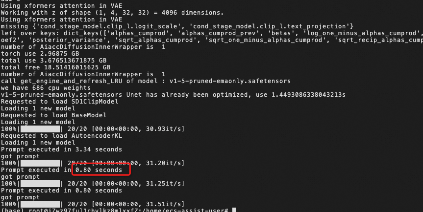

## F&Q
### 如何重启服务
一种方法是使用运维服务重启：

另一种方法是进入终端重启：

   - 可使用如下命令停止服务:
      - systemctl stop comfyui 
   - 可使用如下命令打开服务:
      - systemctl start comfyui
### 如何查看log

      - cat /var/log/comfyui.log
